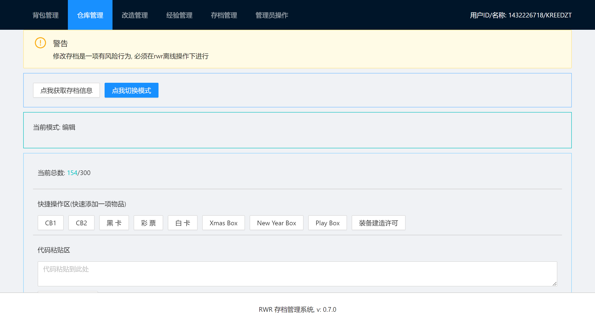

# RWR GFL 存档管理系统


## 成品展示



## 开发

> 该项目依赖后端运行, 具体请参考后端的开发操作: https://github.com/Kreedzt/rwr-profile-server

该项目依赖 [Nodejs](https://nodejs.org/en/) 进行开发

首先安装依赖包, 该项目采用 `pnpm` 进行包管理

安装 `pnpm` 命令:

```sh
npm i -g pnpm
```

安装依赖包:

```sh
pnpm i
```

启动开发环境

```sh
pnpm dev
```

启动后会在终端输出本地端口, 使用浏览器访问即可

## 构建

该项目依赖 [Nodejs](https://nodejs.org/en/) 进行打包操作

首先安装依赖包, 该项目采用 `pnpm` 进行包管理

安装 `pnpm` 命令:

```sh
npm i -g pnpm
```

安装依赖包:

```sh
pnpm i
```

构建

```sh
pnpm build
```

执行后会在 `dist` 目录下生成打包后代码

## 特性

- 用户登录注册
  - 提供基本的注册与登录
- 背包管理
  - 提供背包更新快捷操作与代码粘贴操作
- 仓库管理
  - 提供背包更新快捷操作与代码粘贴操作
- 改造管理
  - 改造更换
- 经验管理
  - 提供快速重置经验到 5 星人型等
- 存档管理
  - 提供存档下载
  - 提供存档上传
- 管理员操作
  - 提供全服及指定玩家发放物品功能
  - 提供存档信息查询功能
  - 提供全服兵种调整功能
  - 提供全服物品删除功能
  - 提供查询指定用户存档信息功能
  
## 部署

见 [部署文档](https://github.com/Kreedzt/rwr-profile-web/blob/master/DEPLOYMENT.md)

## 其他项目

- [RWR GFL 存档数据可视化](https://github.com/Kreedzt/rwr-profile-visualization)
- [RWR GFL 存档管理服务](https://github.com/Kreedzt/rwr-profile-server)
- [RWR GFL 存档数据查询](https://github.com/Kreedzt/rwr-profile-stats)

## 协议

- [GPLv3](https://opensource.org/licenses/GPL-3.0)
